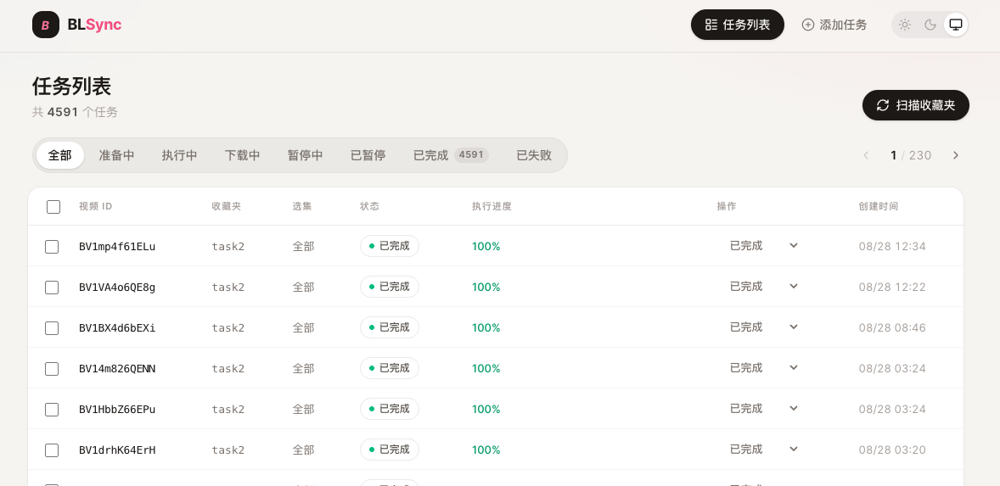
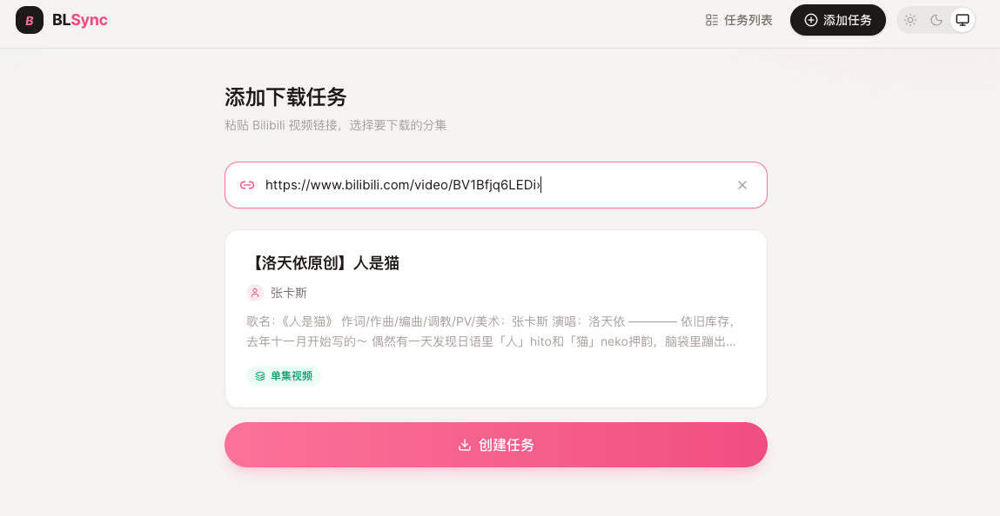

# BLSync

[BLSync](https://github.com/oxygenkun/BLSync) 是一个 Bilibili 收藏夹同步工具。

> 疯狂完善功能中……

# 功能

- [x] 支持收藏夹同步
- [x] 支持外部 API 下载请求
- [x] 支持 WebUI
- [ ] 支持稍后观看同步
- [ ] 支持 UP 主视频同步
- [ ] 支持 UP 主动态图片、动态文字同步
- [ ] 支持个人动态同步
- [ ] 支持外部下载工具
  
# 界面

任务栏



手动下载



# 使用

## Windows 桌面版（推荐）

从 [GitHub Releases](https://github.com/oxygenkun/BLSync/releases) 下载与当前版本对应的 Windows x64 安装包或便携版

首次启动会自动创建配置和下载目录；可在“设置”页面修改运行配置，并使用扫码登录获取 Bilibili 凭证。

便携版优先把配置、数据库和下载文件保存在程序同目录的 `BLSyncData` 中；如果程序目录不可写，则使用系统应用数据目录。

## Docker Compose 运行（推荐）

> 你需要了解docker compose的基本用法。

1. 创建目录结构

```bash
mkdir blsync
cd blsync
mkdir config/     # 配置和记录目录
mkidr sync/       # 下载文件存储目录
```

2. 创建 `compose.yaml` 文件

```yaml
services:
  blsync:
    image: ghcr.io/oxygenkun/blsync:latest
    container_name: blsync
    ports:
      - "8000:8000"
    volumes:
      - ./config:/app/config
      - ./sync:/app/sync
    environment:
      - TZ=Asia/Shanghai
    restart: unless-stopped
```

3. 创建配置文件 `./config/config.toml`（内容写法在[配置文件](#配置文件)章节）

4. 启动服务与常用命令

```shell
# 启动服务（后台运行）
docker compose up -d

# 停止服务
docker compose down
```

## 源码运行

> 你需要在命令行环境安装uv、ffmpeg

```shell
# 同步运行环境
uv sync

# 启动服务
uv run bs -c config/config.toml
```

> `bs` 是项目提供的命令行工具，通过 pyproject.toml 中的 `[project.scripts]` 定义

# 配置与登录

WebUI 和桌面版均可在“设置”页面管理常用配置、收藏夹任务以及 Bilibili 登录凭证。扫码登录成功后请保存配置，再按需触发收藏夹扫描。

也可以直接编辑配置文件：

默认读取 `./config/config.toml` 文件 （参考模板文件 [`./config/config.template.toml`](./config/config.template.toml) 中的说明）。

## 收藏夹 id (fid) 获取方法


浏览器可以看到 `fid=xxxx`，只需要后面数字即可


# 手动下载接口

服务启动后，可以通过 HTTP API 手动添加 Bilibili 视频下载任务。

```http
POST /api/task/bili
Content-Type: application/json
```

请求参数：

| 字段 | 类型 | 必填 | 说明 |
| --- | --- | --- | --- |
| `bid` | string | 是 | Bilibili 视频 BV 号，例如 `BV1xxxx` |
| `favid` | string | 否 | 收藏夹 id，默认 `-1`。`-1` 表示通过 API 手动添加的任务 |
| `selected_episodes` | number[] | 否 | 需要下载的分 P 索引列表，不传则下载全部分 P |

示例：

```bash
curl -X POST "http://127.0.0.1:8000/api/task/bili" \
  -H "Content-Type: application/json" \
  -d '{
    "bid": "BV1xxxx",
    "favid": "-1",
    "selected_episodes": [0, 1]
  }'
```

返回示例：

```json
{
  "status": "success",
  "message": "Task BV1xxxx added to database",
  "task_id": 1
}
```

如果任务已存在，接口会更新任务上下文；当已存在任务处于 `failed` 或 `completed` 状态时，会重置为待下载状态。

手动下载任务默认使用 `favid = -1`，需要在配置文件中为该任务配置下载目录：

```toml
[favorite_list.task0]
fid = -1
path = "sync/"
```

# 更新日志

[CHANGELOG](./CHANGELOG.md)

# 特别感谢

该项目实现过程中主要参考借鉴了如下的项目，感谢他们的贡献：

- [bili-sync](https://github.com/amtoaer/bili-sync) 项目功能和配置的参考
- [bilibili-API-collect](https://github.com/SocialSisterYi/bilibili-API-collect) B 站的第三方接口文档
- [bilibili-api](https://github.com/Nemo2011/bilibili-api) B 站接口 Python SDK 封装 
- [yutto](https://github.com/yutto-dev/yutto) B 站视频下载器
